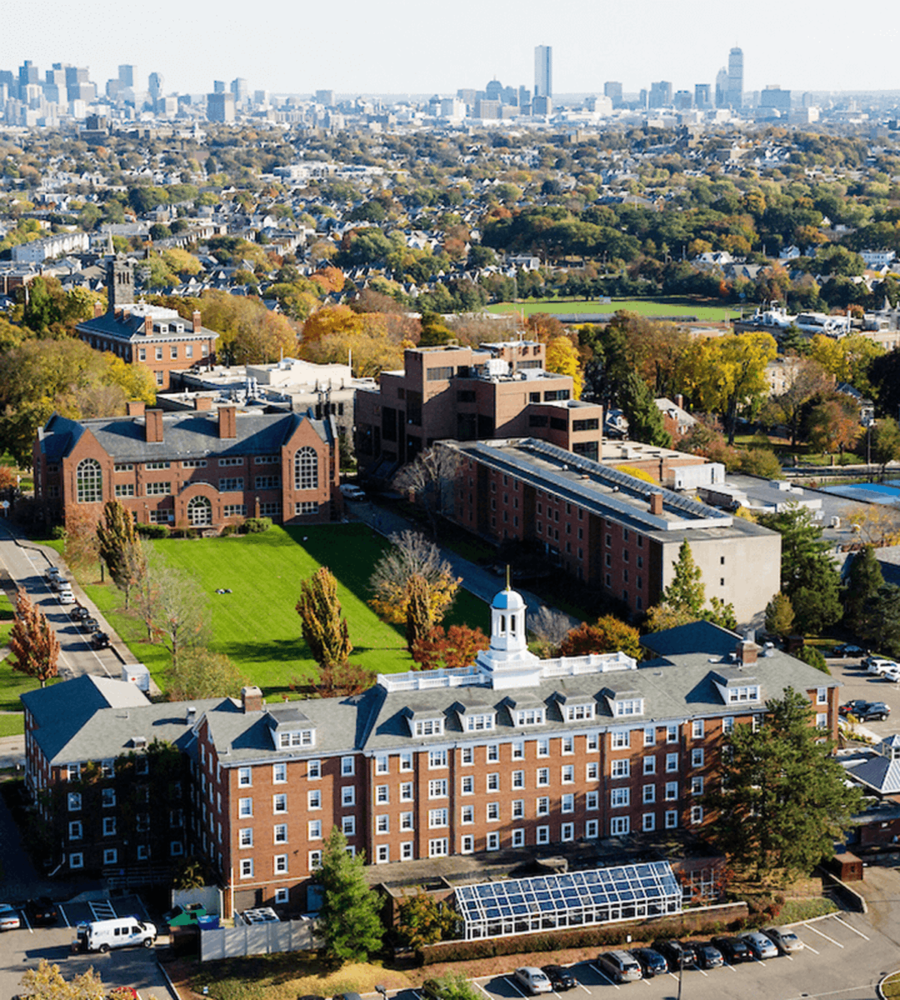

# Welcome to the Ding Group Website

{ align=right width=400 }

Research in our group is focused on developing advanced computational methods by combining statistical mechanics, molecular dynamics and machine learning. Using these powerful innovative techniques, we strive to tackle complex challenges in chemistry and biophysics. Our primary focus is to address critical problems related to understanding biomolecular condensates and computational drug design.
