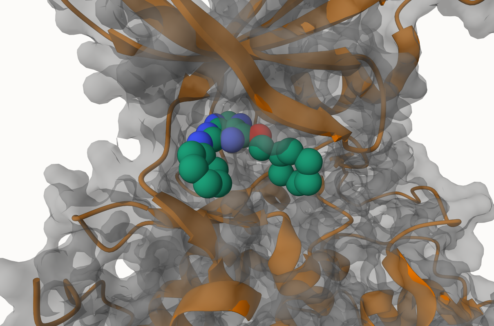
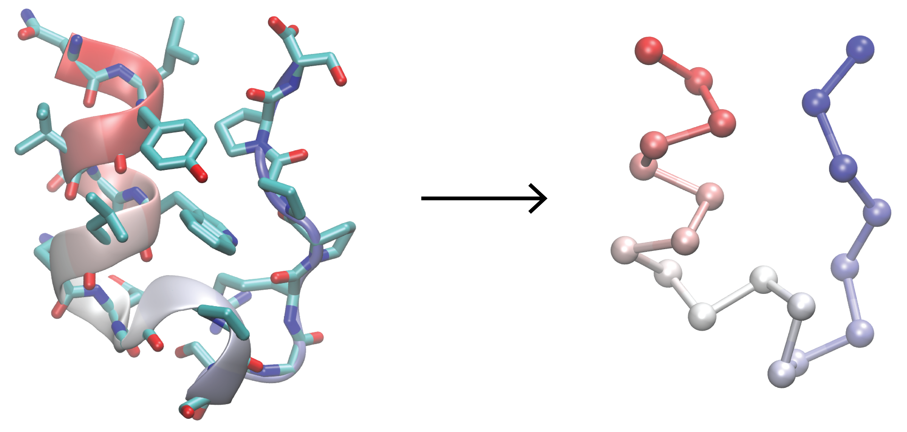
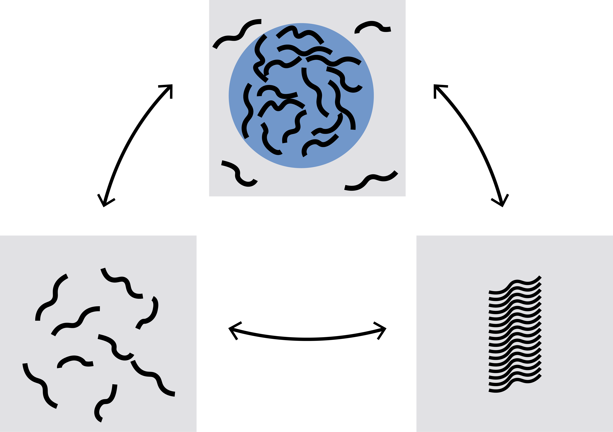

# Research Interests

- :material-pill:{ .lg .middle } __Computational Drug Design__   
  Drug discovery is a slow and expensive process. We aim to accelerate drug discovery by developing advanced computational methods. Specifically, we focus on developing efficient and accurate methods for computing protein-ligand binding free energy. Our approaches are based on rigorous synergy between statistical mechanics and machine learning. Recent advances in machine learning, especially deep probabilistic models, present great opportunities for developing revolutionary methods for drug design. 

- :material-triforce:{ .lg .middle} __Coarse-Grained Force Field Development__   
Due to the limited computing speed of existing computers, simulating large chemical and biological systems requires coarse-grained simulations. We aim to develop an accurate and transferable coarse-grained force field for biomolecules in a systematic way. The data used for learning such a force field include both all-atom simulations and experimental data. Our new learning algorithm, potential contrasting, will be employed to efficiently learn the coarse-grained force field from a large amount of data. 

- :material-dots-circle:{ .lg .middle } __Multiscale Modeling of Biomolecular Condenstates__  
A recent exciting discovery in biological science is recognizing the importance of biomolecules’ phase behavior for cells. The phase of particular interest is biomolecular condensate formed by liquid-liquid phase separation. Like membranes, biomolecular condensates work as a general compartmentalization mechanism to organize cellular matters and reactions. Biomolecular condensates are tightly regulated in cells. Disorders in their formation and dissolution can lead to protein misfolding and aggregation, which are associated with aging-related diseases. We aim to have a mechanistic understanding of biomolecular condensates via simulations at different scales. 

- :material-tools:{ .lg .middle } __Method Development Combining MD and ML__  
Molecular simulations, complementary to experimental techniques, have been an indispensable tool for studying both chemical and biological processes by providing dynamic information near/at the atomic level. Like any other tools, however, molecular simulations still have limitations especially when they are applied to complex systems. Machine learning, with its recent significant advances, offers new computational methods and software tools that are complementary to molecular simulations. We aim to rigorously combine machine learning with molecular dynamics to develop new efficient simulation methods for general use. 

<!-- 

-   :material-pill:{ .lg .middle } __Computational Drug Design__

    ---

    { align=left height=400 }
    Drug discovery is a slow and expensive process. We aim to accelerate drug discovery by developing advanced computational methods. Specifically, we focus on developing efficient and accurate methods for computing protein-ligand binding free energy. Our approaches are based on rigorous synergy between statistical mechanics and machine learning. Recent advances in machine learning, especially deep probabilistic models, present great opportunities for developing revolutionary methods for drug design. 

-   :material-triforce:{ .lg .middle} __Coarse-Grained Force Field Development__

    ---

    { align=left height=400 }

    Due to the limited computing speed of existing computers, simulating large chemical and biological systems requires coarse-grained simulations. We aim to develop an accurate and transferable coarse-grained force field for biomolecules in a systematic way. The data used for learning such a force field include both all-atom simulations and experimental data. Our new learning algorithm, potential contrasting, will be employed to efficiently learn the coarse-grained force field from a large amount of data. 

-   :material-dots-circle:{ .lg .middle } __Multiscale Modeling of Biomolecular Condenstates__

    ---

    { align=left height=400 }
    A recent exciting discovery in biological science is recognizing the importance of biomolecules’ phase behavior for cells. The phase of particular interest is biomolecular condensate formed by liquid-liquid phase separation. Like membranes, biomolecular condensates work as a general compartmentalization mechanism to organize cellular matters and reactions. Biomolecular condensates are tightly regulated in cells. Disorders in their formation and dissolution can lead to protein misfolding and aggregation, which are associated with aging-related diseases. We aim to have a mechanistic understanding of biomolecular condensates via simulations at different scales. 

    [:octicons-arrow-right-24: Customization](#)

-   :material-tools:{ .lg .middle } __Method Development Combining MD and ML__

    ---

    { align=left height=400 }

    Molecular simulations, complementary to experimental techniques, have been an indispensable tool for studying both chemical and biological processes by providing dynamic information near/at the atomic level. Like any other tools, however, molecular simulations still have limitations especially when they are applied to complex systems. Machine learning, with its recent significant advances, offers new computational methods and software tools that are complementary to molecular simulations. We aim to rigorously combine machine learning with molecular dynamics to develop new efficient simulation methods for general use. 

 -->
