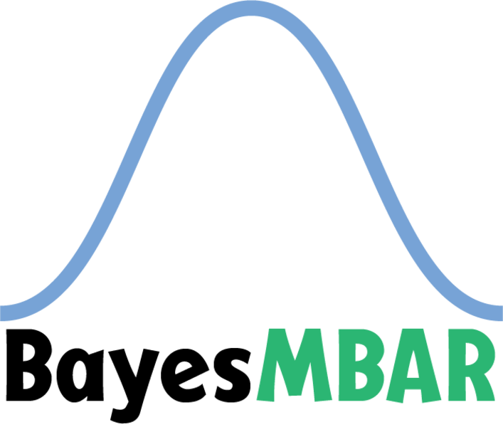

- [**BayesMBAR**](https://github.com/DingGroup/BayesMBAR)  
BayesMBAR is a Bayesian generalization of the multistate Bennett acceptance ratio (MBAR) method for estimating free energy differences between thermodynamic states. By integration of configurations sampled from thermodynamic states with a prior distribution, BayesMBAR computes a posterior distribution of free energies, from which free energy estimations and their associated uncertainties are obtained. Compared to MBAR, BayesMBAR provides more accurate uncertainty estimates and can incorporate prior knowledge into the estimation to improve the accuracy of the free energy estimates. 

- [**FastMBAR**](https://github.com/BrooksResearchGroup-UM/FastMBAR)  
FastMBAR is a Python solver for large scale MBAR/UWHAM equations running on both CPUs and GPUs. It can compute relative free energies of a large number of thermodynamic states used in alchemical free energy calculations and calculating potential of mean force (PMF) in umbrella sampling and temperature/Hamiltonian replica exchange simulations. 

- [**Potential Contrasting**](https://github.com/DingGroup/pccg)  
Potential contrasting is an efficient method for learning a potential energy function that can reproduce an ensemble of molecular conformations. It can be easily applied to can learn coarse-grained force fields based on all-atom simulations. It generalizes the noise contrastive esitmation method to use complex unnormalized noise distributions constructed using molecular dynamics techniques such as umbrella sampling. 

- [**OpenAtom**](https://github.com/DingGroup/openatom)  
Open alchemical transformation of molecules.

<!-- 

-   __BayesMBAR__

    ---

    { align=left }
    BayesMBAR is a Bayesian generalization of the multistate Bennett acceptance ratio (MBAR) method for estimating free energy differences between thermodynamic states. By integration of configurations sampled from thermodynamic states with a prior distribution, BayesMBAR computes a posterior distribution of free energies, from which free energy estimations and their associated uncertainties are obtained. Compared to MBAR, BayesMBAR provides more accurate uncertainty estimates and can incorporate prior knowledge into the estimation to improve the accuracy of the free energy estimates. 

-   __FastMBAR__

    ---

    { align=left }
    FastMBAR is a Python solver for large scale MBAR/UWHAM equations running on both CPUs and GPUs. It can compute relative free energies of a large number of thermodynamic states used in alchemical free energy calculations and calculating potential of mean force (PMF) in umbrella sampling and temperature/Hamiltonian replica exchange simulations. 

-   __Potential Contrasting__

    ---

    { align=left }
    Potential contrasting is an efficient method for learning a potential energy function that can reproduce an ensemble of molecular conformations. It can be easily applied to can learn coarse-grained force fields based on all-atom simulations. It generalizes the noise contrastive esitmation method to use complex unnormalized noise distributions constructed using molecular dynamics techniques such as umbrella sampling. 

 -->
